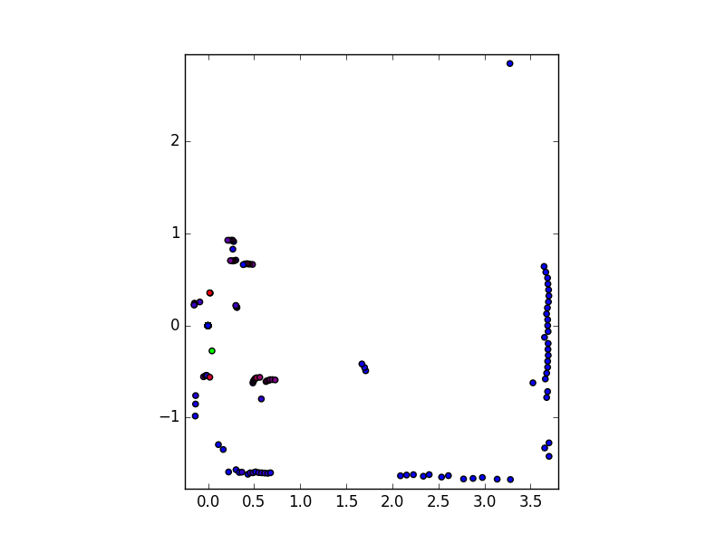

# Table of Contents
- [Test Mode](#test_mode)
- [LDS Scans](#lds_scans)
- [Motion Commands](#motion_commands)

# Test Mode <a name="test_mode" />
In order to send motion commands to the robot or retrieve sensor data
the robot must first be in Test Mode.
When finished, the robot should be taken out of Test Mode.

To put the robot in Test Mode
```
testmode on
```

To take the robot out of Test Mode
```
testmode off
```

# LDS Scans <a name="lds_scans" />
To retrieve laser scan data from the robot, the Laser Distance Scanner (LDS)
must first be on. Once on, scans can be retrieved.

To turn on the LDS
```
setldsrotation on
```

To turn off the LDS
```
setldsrotation off
```

To retrieve a scan
```
getldsscan
```

The output will be a table of distance measurements, intensities, and error
codes, indexed by scan angle in degrees.
Angle 0 points in the direction of the front of the robot.
An example of the output of this command can be seen [here](example_outputs/lds_scan.txt).
When plotted, it will produce the below image.


# Motion Commands <a name="motion_commands" />
The can be moved by commanding each wheel to travel some linear distance,
and by specifying the linear speed of the robot.
Linear wheel distance is commanded in millimeters, and the robot linear speed
is in millimeters/second. The maximum speed is 350 mm/sec.

```
setmotor lwheeldist [dist-in-mm] rwheeldist [dist-in-mm] speed [speed-mm-sec]
```

For example, to command the robot to go straight by 1 meter at 0.1 meters/second
```
setmotor lwheeldist 1000 rwheeldist 1000 speed 100
```
